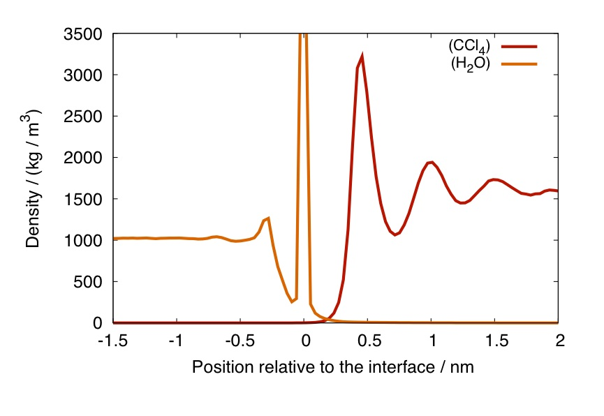

# Intrinsic Profiles in-a-Nutshell

How does the presence of an interface between two fluids change
their properties? All observables should in principle depend on the
distance from the interface, but the presence of capillary waves
induced by thermal fluctuations complicates their calculation, as
the wave modes spectrum depends on the wave vector q as

and the larger your sample is, the larger will be the amplitude of
compatible, long wavelength excitations. These capillary waves will
smear any profile that is computed across the interface. If the
position of the interface is in contrary known at each and every
point, it is possible to construct profiles ρ(z) which are intrinsic
(with respect to the interface),

where the index i identifies the i-th particle in one phase, and z
is now the position with respect to the local interface. The usual,
smoothed, density profiles, once computed with respect to the local
interface position, start showing rich features like in the case
presented in the plot below, showing the intrinsic mass density
profile at the water / carbon tetrachloride interface.

_Intrinsic mass density profile of water (left) and carbon tetrachloride at the interface between the two fluids, with respect to the water phase._

This profile has been calculated using the water phase to define
the interface. For this reason, at zero intrinsic distance (i.e.,
at the surface) there will be only atoms from the water phase,
hence, the Dirac delta contribution at z=0. 

[ [Back to the Tutorial](TUTORIAL.md) ]

[ [Back to the Main Page](README.md) ]
