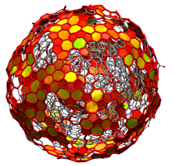
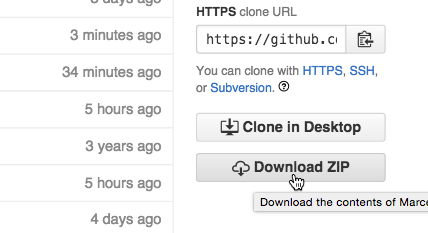

## Status  

## Quick links
*  [References](#references)
*  [How to compile](#how-to-compile)
*  [Tutorial](TUTORIAL.md)

# What is ITIM/GITIM?  

**ITIM** and **GITIM** are two algorithms for the identification
of interfacial molecules or atoms. GITIM is a generalization of the
ITIM algorithm, which has been designed for planar interfaces. GITIM,
on the contrary, is free from any geometrical constraints and can
be used to analyze intrinsic properties of surfaces with arbitrary
shape. 

### What can I find here ? 

* Two code branches,
[ITIM](https://github.com/Marcello-Sega/gitim/tree/ITIM) and
[GITIM](https://github.com/Marcello-Sega/gitim/tree/GITIM), which
implement the respective algorithms in the form of a program that
can read [GROMACS](http://www.gromacs.org) trajectories.

* Instructions on [how to compile](#how-to-compile) the software
 
* A tutorial on how to compute intrinsic profiles

* References

### Which branch should I use, ITIM or GITIM? 

If you are interested in planar interfaces only, use the ITIM branch.

Currently the code is undergoing a major restructuring, with new
features added and bugs fixed. The ITIM branch is so far the most
up-to-date, with a new build system that ensures compatibility with
a broader range of GROMACS versions. New features/bugfix are being
backported to the GITIM branch.

### Which features are included? 
* Identification of interfacial atoms
* Identification of interfacial molecules
* Identification of further atomic/molecular layers
* Cluster search to deal with partially miscible systems
* Calculation of intrinsic and non-intrinsic density and mass profiles
* Use of enhanced Monte Carlo sampling to take into account the fluctuations of the opposite interface on the density profiles
* Exporting PDB files containing also the information on the layer to which atoms belong to, as well as the intrinsic distance from the surface.

_Note: Some of the features are so far present only in the ITIM branch and are currently being ported to the GITIM branch._

### Which code is faster, ITIM or GITIM

ITIM, by far. This is because GITIM needs to compute the alpha-shape
of the phase, which in turn relies on the Delauney triangulation.
This is done through QHull, but it is still much slower than the
ITIM algorithm.  So, if you only have to deal with planar interfaces,
go for the ITIM branch.

### What do I need to build the code ? 

* A gromacs build + sources (compatibility starting from GROMACS 4.6.7 up to 5.1) 
* Cmake >= 2.8.11

### What can you do with GITIM?

Check out the [usage example page](http://www.gitim.eu/usage-examples) of the gitim web site http://www.gitim.eu

---------------------------

# References

If you use this code to publish some research results, please read and cite both of the two following papers.

[M. Sega, S. S. Kantorovich P. Jedlovszky and M. Jorge, _J. Chem. Phys._ **138**, 044110 (2013)](http://dx.doi.org/10.1063/1.4776196) The generalized identification of truly interfacial molecules (ITIM) algorithm for nonplanar interfaces.

[L. B. Pártay, G. Hantal, P. Jedlovszky, Á. Vincze and G. Horvai, _J. Comp. Chem._ **29**, 945 (2008)] (http://dx.doi.org/10.1002/jcc.20852)
A new method for determining the interfacial molecules and characterizing the surface roughness in computer simulations. Application to the liquid–vapor interface of water

-----------------

#How to compile

###Requirements
* A working version of GROMACS (source code _and_ build tree)
* Cmake (>= 2.8.11)
* For GITIM only, the [Gnu Scientific Library](http://www.gnu.org/software/gsl/) (GSL)

Support of GROMACS versions from 4.6 up to 5.1 (included) is guaranteed for the [ITIM](https://github.com/Marcello-Sega/gitim/tree/ITIM) branch.
For the [GITIM](https://github.com/Marcello-Sega/gitim/tree/GITIM)
branch, the build system is currently being updated, and out-of-the-box
compatibility with all GROMACS version is not guaranteed.

###Obtaining the software
If you have `git` installed on your system, simply use the command

    git clone https://github.com/Marcello-Sega/gitim.git

Otherwise, download the latest commit from the web interface:

###Configuring and building

enter the repository and create a build directory
  
    cd gitim  
    mkdir build
    cd build

There, launch cmake providing the location of your gromacs tree
and your gromacs build (these two could coincide), for example:

    cmake .. -DMYGMX_SRC=~/gromacs-5.0.6/ -DMYGMX_BUILD=~/gromacs-5.0.6/build/

compile with 
   
    make

Done!

Here is what I see on my terminal when I do a fresh install:

     > clear

     > git clone https://github.com/Marcello-Sega/gitim.git

     Cloning into 'gitim'...
     remote: Counting objects: 590, done.
     remote: Compressing objects: 100% (43/43), done.
     remote: Total 590 (delta 91), reused 69 (delta 69), pack-reused 478
     Receiving objects: 100% (590/590), 2.61 MiB | 1.55 MiB/s, done.
     Resolving deltas: 100% (322/322), done.
     Checking connectivity... done.

     > cd gitim

     > ls

     CMakeLists.txt COPYING        DISCLAIMER     HOWTO          README.md      examples       gmx_itim.cpp   maintainer     media

     > mkdir build
     > cd build/

     > cmake .. -DMYGMX_TREE=~/gromacs-5.0.6/ -DMYGMX_BUILD=~/gromacs-5.0.6/build/

     -- The CXX compiler identification is AppleClang 6.0.0.6000056
     -- Check for working CXX compiler: /usr/bin/c++
     -- Check for working CXX compiler: /usr/bin/c++ -- works
     -- Detecting CXX compiler ABI info
     -- Detecting CXX compiler ABI info - done
     -- checking version file ~/gromacs-5.0.6/build/src/external/tng_io/include/tng/version.h
     -- checking version file ~/gromacs-5.0.6/build/src/gromacs/version.h
     -- ============================================================
     -- GMX version: 50000    on    Darwin-14.5.0   
     -- ============================================================
     -- 
     -- ==================================================
     -- Using libraries: ~/gromacs-5.0.6/build/lib/libgromacs.dylib 
     -- ==================================================
     -- 
     -- GMX LIB:  ~/gromacs-5.0.6/build/lib/libgromacs.dylib
     -- Configuring done
     -- Generating done
     -- Build files have been written to: /tmp/gitim/build

     > make

     Scanning dependencies of target g_itim
     [100%] Building CXX object CMakeFiles/g_itim.dir/gmx_itim.cpp.o
     Linking CXX executable g_itim
     [100%] Built target g_itim

     > ls

     CMakeCache.txt      CMakeFiles          Makefile            cmake_install.cmake examples            g_itim

---------------------------

